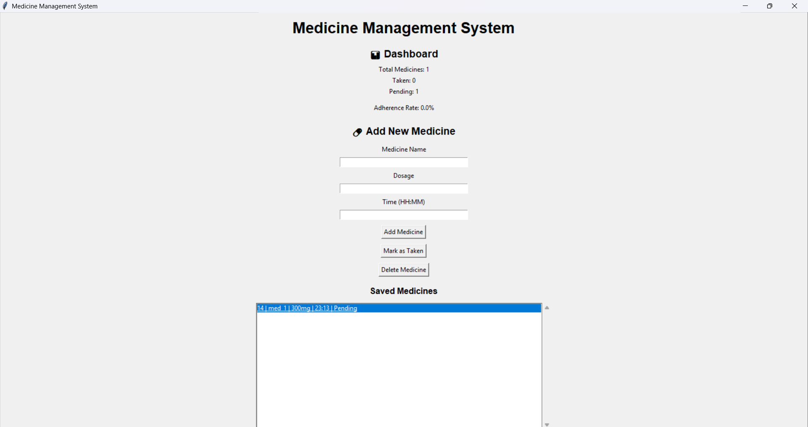
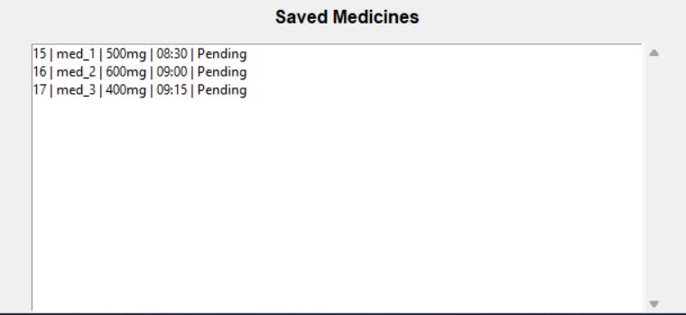
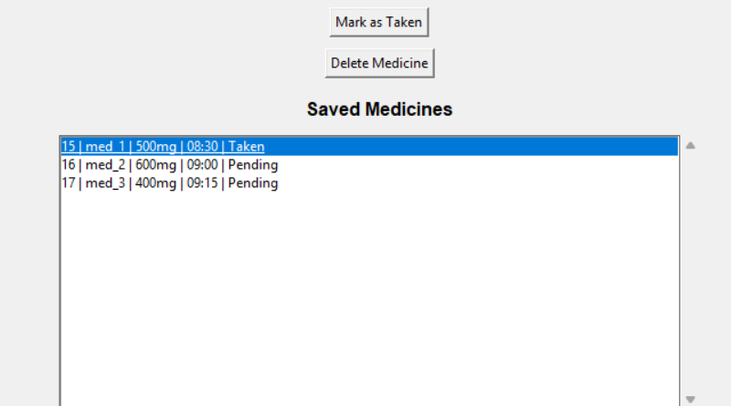
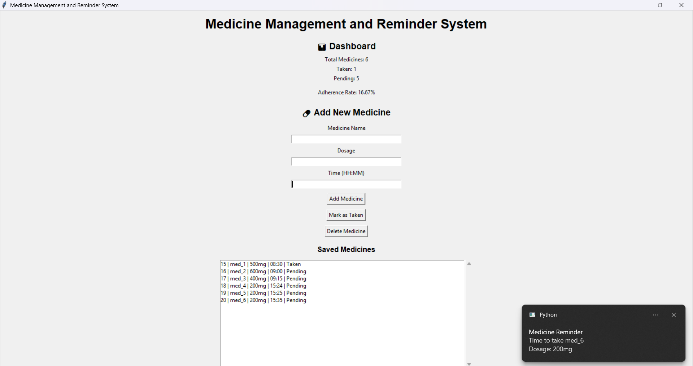

# Medicine Management and Reminder System

## Project Description

The Medicine Management and Reminder System is a desktop application developed using Python. It helps users manage their medicines and receive reminders at the scheduled time. The system stores medicine information in a database and allows users to track whether medicines have been taken or are still pending.

## Features

* Add medicine details
* Store medicine records in SQLite database
* View all saved medicines
* Mark medicines as taken
* Delete medicines
* Desktop reminder notifications
* Dashboard showing medicine statistics
* Scrollable medicine list

## Technologies Used

* Python
* Tkinter
* SQLite
* Plyer
* GitHub

## Project Structure

Medicine-Management-and-Reminder-System

├── main.py

├── database_setup.py

├── README.md

├── screenshots/

└── .gitignore

## How to Run the Project

1. Install Python.
2. Install the required library:

pip install plyer

3. Create the database:

python database_setup.py

4. Run the application:

python main.py

## Screenshots

### Main Application Window

### Medicine List

### Dashboard Statistics

### Mark as Taken

### Desktop Notification

## Future Improvements

* Mobile application support
* Cloud database integration
* Email and SMS reminders
* User authentication
* Multi-user support

## Team Members

* Garima Rajput (BTE25DSC100001)
* Madhusudhan Kumar (BTE25DSC100002)

## Guide

Anuj Tomar (Faculty)

## Conclusion

This project provides a simple and effective solution for medicine management and reminder generation. It demonstrates the use of Python GUI programming, database management, and desktop notification systems in a practical healthcare application.
